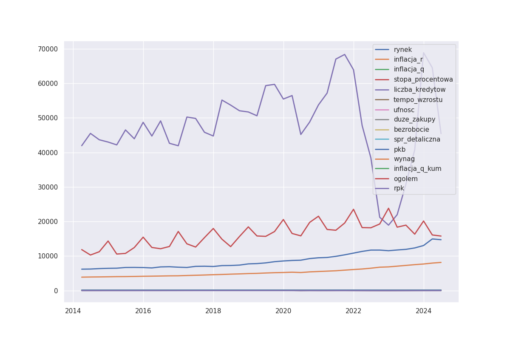
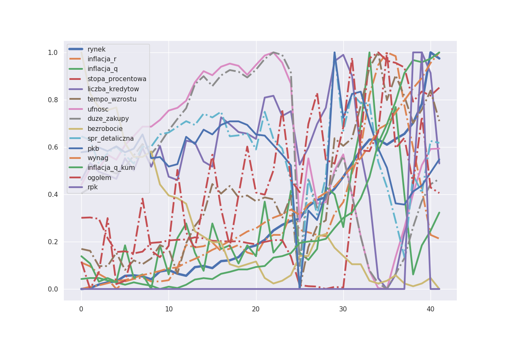

## Zadanie

Powyższe dane przedstawiają szereg czasowy średnich kwartalnych jednostkowych cen transakcyjnych metra kwadratowego mieszkań na rynku pierwotnym w segmencie 7 dużych miast (Warszawa, Kraków, Wrocław, Poznań, Gdańsk, Gdynia, Łódź) - źródło CBN.
Dodatkowo, przedstawiono przykładowy zestaw wskaźników dotyczących zmiennych reprezentujących kategorie mogące mieć potencjalny wpływ na kształtowanie się cen nieruchomości mieszkaniowych.

ZADANIE - przedstaw koncepcję budowy modelu predykcyjnego cen transakcyjnych metra kwadratowego mieszkania na rynku pierwotnym w segmencie 7 dużych miast 
(jeśli dysponujesz narzędziem by taki model stworzyć, to mile wiedziane będzie przedstawienie prognozy na 4Q2024 oraz na 4Q2025 na podstawie wskazania tego modelu)																	

- metoda analizy, postać modelu - dowolne ;
- w modelu można - choć nie trzeba - wykorzystać dowolny zestaw zmiennych objaśniających egzogenicznych (można uwzględnić dane przedstawione pod szeregiem czasowym cen albo inne dostępne dane)

UWAGA! Gwałtowny wzrost popytu na kredyty i nieruchomości mieszkaniowe w drugiej połowie 2023 wynika z uruchomienia rządowego programu kredytów z preferencyjnym oprocentowaniem Bezpieczny Kredyt 2% (program był aktywny w okresie 01-07-2023 do 31-12-2023). Powyższe miało wpływ na dynamikę zmian cen w okresie 3Q2023 - 1Q2024. 
Program Bezpieczny Kredyt 2% został wygaszony z końcem 2023 roku. Na dzień dzisiejszy nie wiadomo czy zostanie wdrożony nowy program wsparcia dla kredytobiorców, dlatego należy przyjąć założenie, że w okresie objętym prognozą żadna forma wsparcia nie będzie funkcjonować.																	

## Dane
Dane składają się z 11 kolumn bez brakujących punktów. Każda kolumna ma 42 wpisy wyznaczone na kwartały dla ostatnich 10 lat,  aby uzyskać więcej informacji, przeczytaj [tutaj](./pdfs/1_data_import.pdf). Moim zdaniem długość szeregów czasowych jest zbyt krótka, aby umożliwić efektywne modelowanie. Mimo to rynek nieruchomości w Polsce znajduje się w bezprecedensowej sytuacji rozwoju gospodarki. Przekształcając dane wejściowe na szeregi czasowe oznaczyłem je ostatnim dniem każdego kwartału, przeczytaj [tutaj](./pdfs/2_converting_to_ts.pdf).

Dla wygody zmieniono nazwy kolumn
```json
{
    "7M rynek pierwotny - CBNavg": "rynek",
    "Inflacja - indeks r/r (GUS)": "inflacja_r",
    "Inflacja - indeks q/q (GUS)": "inflacja_q",
    "stopa procentowa nowo udzielonych kredytów (AMRON Sarfin) ": "stopa_procentowa",
    "liczba udzielonych kredytów mieszkaniowych (AMRON Sarfin)": "liczba_kredytow",
    "tempo wzrostu wynagrodzeń w sektorze przedsiębiorstw r/r (NBP)": "tempo_wzrostu",
    "koniunktura konsumencka - bieżący wskaźnik ufności (GUS)": "ufnosc",
    "koniunktura konsumencka - obecne dokonywanie du|ych zakupów (GUS)": "duze_zakupy",
    "stopa bezrobocia - w % (GUS)": "bezrobocie",
    "dynamika sprzedaży detalicznej - indeks r/r (GUS)": "spr_detaliczna",
    "dynamika PKB - indeks r/r (GUS)": "pkb"
}
```

## Inne źródła informacji
W trakcie rozwiązania zadania, zapoznałem się z następnymi materialami.

1. artykul na rmf.pl/ekonomia [13], zawierający następujące tezy:
   
> __Czy gdyby podaż nieruchomości przewyższała popyt, można spodziewać się obniżek cen?__? Deweloperzy są w tak dobrej kondycji po ostatnich bardzo dobrych dla nich latach, że w sytuacji, gdyby wysoka podaż wywierała presję na obniżkę ceny, mogą ten moment przeczekać - mają bowiem silne bilanse i stać ich na czekanie.

> Trendu bocznego w cenach średnich w dużych miastach. Lekkiego spadku cen (powolnego) w małych miastach. __Wyspowych głośnych dowodów na spadki i na wzrosty__ - to znaczy w zależności od tezy - będzie można znaleźć dane potwierdzające zarówno spadki (w wybranych segmentach, metrażach, rynek pierwotny versus rynek wtórny, miastach, etc.), jak i wzrosty.

> __Coraz mniejszy sens będzie miało patrzenie na średnie ceny__ dla Polski, a coraz ważniejsze będzie patrzenie przez pryzmat poszczególnych segmentów.

> __Cały czas będzie silny, choć nie rosnący, trend inwestowania w mieszkania na wynajem__.

> __Nic nie wskazuje, by czekało nas załamanie, ani dalsza koniunktura jak ostatnio__. Musimy pamiętać, że jesteśmy po latach rekordowych pod wieloma względami i kolejne lata będą na ich tle wzbudzały emocje.  

2. Wideo na YouTube [11] Macieja Gołębiewskiego, gdzie stwierdza, że ​​ceny nieruchomości są stabilne według średniej pensji skorygowanej o inflację. Próbowałem powtórzyć jego podejście i uzyskałem podobne wyniki, więcej [tutaj](./pdfs/3_kor_wynag_cena.pdf)
   

3. W artykule naukowym [7] badającym zależności cen nieruchomości w Polsce podano:

>  Rynek nieruchomości w Polsce charakteryzuje się znaczną orientacją kredytową, co jest ułatwione przez długoterminowe stabilne lub spadające stopy procentowe kredytów hipotecznych i pożyczek udzielanych przedsiębiorstwom i zabezpieczonych nieruchomościami. Od 2012 r. takie kredyty walutowe są praktycznie niedostępne ze względu na stabilność złotego i dość atrakcyjną politykę cenową banków, a także niską wartość pieniądza na rynku finansowym.

4. I co najważniejsze, raport PKO BP [9] wśród wszystkich innych przydatnych informacji mówi o stabilnej dostepności mieszkan w największych miastach (wykres 27).

## Dodatkowe dane 

1. Przeciętne wynagorodzenie od GUS [8], wiejcej [tutaj](./pdfs/gus_wynagrodzenie.pdf).

2. Nowa budowa w Polsce od GUS [8], wiejcej [tutaj](./pdfs/gus_deweloperzy.pdf).


## Wykres aktualnych dannych


## Wykres aktualnych dannych skalowanych



|                  | count |      mean |       std |     min |     25% |     50% |     75% |     max |
| :--------------- | ----: | --------: | --------: | ------: | ------: | ------: | ------: | ------: |
| rynek            |    43 |   8969.26 |   2597.47 | 6193.21 | 6800.58 | 8010.31 | 11087.5 | 14988.4 |
| inflacja_r       |    43 |   103.826 |   5.05494 |    98.5 |  100.45 |   102.4 |   104.5 |   117.3 |
| inflacja_q       |    43 |   100.984 |   1.43061 |    99.3 |  100.05 |   100.5 |  101.65 |   105.8 |
| stopa_procentowa |    43 | 0.0480442 | 0.0219191 |  0.0242 |   0.036 |  0.0382 |  0.0574 |   0.092 |
| liczba_kredytow  |    43 |   48104.1 |   11237.7 |   18932 |   43323 |   47767 |   54456 |   68860 |
| tempo_wzrostu    |    43 |   107.219 |   3.49995 |   102.1 |   104.2 |   106.8 |   110.4 |   114.5 |
| ufnosc           |    43 |  -12.0349 |   14.8078 |   -43.8 |   -21.5 |   -12.5 |    2.25 |     9.1 |
| duze_zakupy      |    43 |  -7.93488 |   16.8792 |   -39.6 |   -17.2 |   -10.7 |      10 |      18 |
| bezrobocie       |    43 |   7.09535 |   2.32122 |     4.9 |     5.3 |     6.1 |    8.25 |    13.5 |
| spr_detaliczna   |    43 |    103.94 |   4.51395 |    89.3 |     102 |   104.8 |   106.3 |   114.4 |
| pkb              |    43 |   103.712 |   3.24516 |    92.3 |  102.65 |   103.9 |   105.3 |   112.2 |

## DIFF(4)

|                  | count |         mean |       std |      min |      25% |     50% |     75% |    max |
| ---------------: | ----: | -----------: | --------: | -------: | -------: | ------: | ------: | -----: |
|            rynek |    39 |       70.923 |   1316.39 | -4239.33 | -326.568 | 92.2113 | 469.816 | 5955.8 |
|       inflacja_r |    39 |   -0.0384615 |    3.6722 |     -6.8 |     -2.7 |    -0.3 |    2.35 |    8.8 |
|       inflacja_q |    39 |   -0.0333333 |   5.58463 |    -10.9 |     -4.8 |    -0.3 |       4 |   13.4 |
| stopa_procentowa |    39 | -5.64103e-05 | 0.0163163 |  -0.0476 |  -0.0046 |  0.0003 | 0.00615 | 0.0392 |
|  liczba_kredytow |    39 |      740.026 |   28358.3 |   -67666 |   -21965 |    2050 |   21779 |  68380 |
|    tempo_wzrostu |    39 |    0.0666667 |   7.68379 |    -21.4 |     -3.5 |    -0.5 |     4.1 |   21.5 |
|           ufnosc |    39 |    -0.148718 |   33.8386 |   -140.1 |    -6.15 |     0.7 |     4.4 |  103.7 |
|      duze_zakupy |    39 |    0.0641026 |      48.5 |     -208 |     -6.7 |     0.3 |    5.05 |  150.3 |
|       bezrobocie |    39 |    0.0435897 |   1.69408 |     -2.7 |     -1.2 |    -0.1 |    1.15 |    3.8 |
|   spr_detaliczna |    39 |     -0.15641 |   25.9084 |      -70 |    -11.4 |     0.6 |    9.85 |   64.4 |
|              pkb |    39 |   -0.0205128 |   16.9326 |    -50.9 |    -3.95 |    -0.8 |    3.75 |     52 |

# Korelacja

<table id="T_6b362">
  <thead>
    <tr>
      <th class="blank level0" >&nbsp;</th>
      <th id="T_6b362_level0_col0" class="col_heading level0 col0" >rynek</th>
      <th id="T_6b362_level0_col1" class="col_heading level0 col1" >inflacja_r</th>
      <th id="T_6b362_level0_col2" class="col_heading level0 col2" >inflacja_q</th>
      <th id="T_6b362_level0_col3" class="col_heading level0 col3" >stopa_procentowa</th>
      <th id="T_6b362_level0_col4" class="col_heading level0 col4" >liczba_kredytow</th>
      <th id="T_6b362_level0_col5" class="col_heading level0 col5" >tempo_wzrostu</th>
      <th id="T_6b362_level0_col6" class="col_heading level0 col6" >ufnosc</th>
      <th id="T_6b362_level0_col7" class="col_heading level0 col7" >duze_zakupy</th>
      <th id="T_6b362_level0_col8" class="col_heading level0 col8" >bezrobocie</th>
      <th id="T_6b362_level0_col9" class="col_heading level0 col9" >spr_detaliczna</th>
      <th id="T_6b362_level0_col10" class="col_heading level0 col10" >pkb</th>
      <th id="T_6b362_level0_col11" class="col_heading level0 col11" >wynag</th>
      <th id="T_6b362_level0_col12" class="col_heading level0 col12" >inflacja_q_kum</th>
      <th id="T_6b362_level0_col13" class="col_heading level0 col13" >ogolem</th>
      <th id="T_6b362_level0_col14" class="col_heading level0 col14" >rpk</th>
    </tr>
  </thead>
  <tbody>
    <tr>
      <th id="T_6b362_level0_row0" class="row_heading level0 row0" >rynek</th>
      <td id="T_6b362_row0_col0" class="data row0 col0" >1.00</td>
      <td id="T_6b362_row0_col1" class="data row0 col1" >0.70</td>
      <td id="T_6b362_row0_col2" class="data row0 col2" >0.57</td>
      <td id="T_6b362_row0_col3" class="data row0 col3" >0.74</td>
      <td id="T_6b362_row0_col4" class="data row0 col4" >-0.02</td>
      <td id="T_6b362_row0_col5" class="data row0 col5" >0.85</td>
      <td id="T_6b362_row0_col6" class="data row0 col6" >-0.54</td>
      <td id="T_6b362_row0_col7" class="data row0 col7" >-0.56</td>
      <td id="T_6b362_row0_col8" class="data row0 col8" >-0.68</td>
      <td id="T_6b362_row0_col9" class="data row0 col9" >-0.22</td>
      <td id="T_6b362_row0_col10" class="data row0 col10" >-0.18</td>
      <td id="T_6b362_row0_col11" class="data row0 col11" >0.99</td>
      <td id="T_6b362_row0_col12" class="data row0 col12" >0.94</td>
      <td id="T_6b362_row0_col13" class="data row0 col13" >0.62</td>
      <td id="T_6b362_row0_col14" class="data row0 col14" >0.36</td>
    </tr>
    <tr>
      <th id="T_6b362_level0_row1" class="row_heading level0 row1" >inflacja_r</th>
      <td id="T_6b362_row1_col0" class="data row1 col0" >0.70</td>
      <td id="T_6b362_row1_col1" class="data row1 col1" >1.00</td>
      <td id="T_6b362_row1_col2" class="data row1 col2" >0.81</td>
      <td id="T_6b362_row1_col3" class="data row1 col3" >0.77</td>
      <td id="T_6b362_row1_col4" class="data row1 col4" >-0.48</td>
      <td id="T_6b362_row1_col5" class="data row1 col5" >0.84</td>
      <td id="T_6b362_row1_col6" class="data row1 col6" >-0.71</td>
      <td id="T_6b362_row1_col7" class="data row1 col7" >-0.65</td>
      <td id="T_6b362_row1_col8" class="data row1 col8" >-0.58</td>
      <td id="T_6b362_row1_col9" class="data row1 col9" >-0.26</td>
      <td id="T_6b362_row1_col10" class="data row1 col10" >-0.10</td>
      <td id="T_6b362_row1_col11" class="data row1 col11" >0.73</td>
      <td id="T_6b362_row1_col12" class="data row1 col12" >0.70</td>
      <td id="T_6b362_row1_col13" class="data row1 col13" >0.65</td>
      <td id="T_6b362_row1_col14" class="data row1 col14" >0.19</td>
    </tr>
    <tr>
      <th id="T_6b362_level0_row2" class="row_heading level0 row2" >inflacja_q</th>
      <td id="T_6b362_row2_col0" class="data row2 col0" >0.57</td>
      <td id="T_6b362_row2_col1" class="data row2 col1" >0.81</td>
      <td id="T_6b362_row2_col2" class="data row2 col2" >1.00</td>
      <td id="T_6b362_row2_col3" class="data row2 col3" >0.59</td>
      <td id="T_6b362_row2_col4" class="data row2 col4" >-0.29</td>
      <td id="T_6b362_row2_col5" class="data row2 col5" >0.74</td>
      <td id="T_6b362_row2_col6" class="data row2 col6" >-0.59</td>
      <td id="T_6b362_row2_col7" class="data row2 col7" >-0.50</td>
      <td id="T_6b362_row2_col8" class="data row2 col8" >-0.50</td>
      <td id="T_6b362_row2_col9" class="data row2 col9" >0.05</td>
      <td id="T_6b362_row2_col10" class="data row2 col10" >0.14</td>
      <td id="T_6b362_row2_col11" class="data row2 col11" >0.56</td>
      <td id="T_6b362_row2_col12" class="data row2 col12" >0.46</td>
      <td id="T_6b362_row2_col13" class="data row2 col13" >0.54</td>
      <td id="T_6b362_row2_col14" class="data row2 col14" >-0.14</td>
    </tr>
    <tr>
      <th id="T_6b362_level0_row3" class="row_heading level0 row3" >stopa_procentowa</th>
      <td id="T_6b362_row3_col0" class="data row3 col0" >0.74</td>
      <td id="T_6b362_row3_col1" class="data row3 col1" >0.77</td>
      <td id="T_6b362_row3_col2" class="data row3 col2" >0.59</td>
      <td id="T_6b362_row3_col3" class="data row3 col3" >1.00</td>
      <td id="T_6b362_row3_col4" class="data row3 col4" >-0.51</td>
      <td id="T_6b362_row3_col5" class="data row3 col5" >0.81</td>
      <td id="T_6b362_row3_col6" class="data row3 col6" >-0.59</td>
      <td id="T_6b362_row3_col7" class="data row3 col7" >-0.60</td>
      <td id="T_6b362_row3_col8" class="data row3 col8" >-0.38</td>
      <td id="T_6b362_row3_col9" class="data row3 col9" >-0.20</td>
      <td id="T_6b362_row3_col10" class="data row3 col10" >-0.10</td>
      <td id="T_6b362_row3_col11" class="data row3 col11" >0.76</td>
      <td id="T_6b362_row3_col12" class="data row3 col12" >0.84</td>
      <td id="T_6b362_row3_col13" class="data row3 col13" >0.32</td>
      <td id="T_6b362_row3_col14" class="data row3 col14" >0.34</td>
    </tr>
    <tr>
      <th id="T_6b362_level0_row4" class="row_heading level0 row4" >liczba_kredytow</th>
      <td id="T_6b362_row4_col0" class="data row4 col0" >-0.02</td>
      <td id="T_6b362_row4_col1" class="data row4 col1" >-0.48</td>
      <td id="T_6b362_row4_col2" class="data row4 col2" >-0.29</td>
      <td id="T_6b362_row4_col3" class="data row4 col3" >-0.51</td>
      <td id="T_6b362_row4_col4" class="data row4 col4" >1.00</td>
      <td id="T_6b362_row4_col5" class="data row4 col5" >-0.15</td>
      <td id="T_6b362_row4_col6" class="data row4 col6" >0.52</td>
      <td id="T_6b362_row4_col7" class="data row4 col7" >0.51</td>
      <td id="T_6b362_row4_col8" class="data row4 col8" >-0.13</td>
      <td id="T_6b362_row4_col9" class="data row4 col9" >0.38</td>
      <td id="T_6b362_row4_col10" class="data row4 col10" >0.30</td>
      <td id="T_6b362_row4_col11" class="data row4 col11" >-0.05</td>
      <td id="T_6b362_row4_col12" class="data row4 col12" >-0.19</td>
      <td id="T_6b362_row4_col13" class="data row4 col13" >0.04</td>
      <td id="T_6b362_row4_col14" class="data row4 col14" >0.13</td>
    </tr>
    <tr>
      <th id="T_6b362_level0_row5" class="row_heading level0 row5" >tempo_wzrostu</th>
      <td id="T_6b362_row5_col0" class="data row5 col0" >0.85</td>
      <td id="T_6b362_row5_col1" class="data row5 col1" >0.84</td>
      <td id="T_6b362_row5_col2" class="data row5 col2" >0.74</td>
      <td id="T_6b362_row5_col3" class="data row5 col3" >0.81</td>
      <td id="T_6b362_row5_col4" class="data row5 col4" >-0.15</td>
      <td id="T_6b362_row5_col5" class="data row5 col5" >1.00</td>
      <td id="T_6b362_row5_col6" class="data row5 col6" >-0.48</td>
      <td id="T_6b362_row5_col7" class="data row5 col7" >-0.44</td>
      <td id="T_6b362_row5_col8" class="data row5 col8" >-0.69</td>
      <td id="T_6b362_row5_col9" class="data row5 col9" >0.03</td>
      <td id="T_6b362_row5_col10" class="data row5 col10" >0.16</td>
      <td id="T_6b362_row5_col11" class="data row5 col11" >0.87</td>
      <td id="T_6b362_row5_col12" class="data row5 col12" >0.82</td>
      <td id="T_6b362_row5_col13" class="data row5 col13" >0.59</td>
      <td id="T_6b362_row5_col14" class="data row5 col14" >0.26</td>
    </tr>
    <tr>
      <th id="T_6b362_level0_row6" class="row_heading level0 row6" >ufnosc</th>
      <td id="T_6b362_row6_col0" class="data row6 col0" >-0.54</td>
      <td id="T_6b362_row6_col1" class="data row6 col1" >-0.71</td>
      <td id="T_6b362_row6_col2" class="data row6 col2" >-0.59</td>
      <td id="T_6b362_row6_col3" class="data row6 col3" >-0.59</td>
      <td id="T_6b362_row6_col4" class="data row6 col4" >0.52</td>
      <td id="T_6b362_row6_col5" class="data row6 col5" >-0.48</td>
      <td id="T_6b362_row6_col6" class="data row6 col6" >1.00</td>
      <td id="T_6b362_row6_col7" class="data row6 col7" >0.98</td>
      <td id="T_6b362_row6_col8" class="data row6 col8" >0.04</td>
      <td id="T_6b362_row6_col9" class="data row6 col9" >0.39</td>
      <td id="T_6b362_row6_col10" class="data row6 col10" >0.29</td>
      <td id="T_6b362_row6_col11" class="data row6 col11" >-0.50</td>
      <td id="T_6b362_row6_col12" class="data row6 col12" >-0.56</td>
      <td id="T_6b362_row6_col13" class="data row6 col13" >-0.35</td>
      <td id="T_6b362_row6_col14" class="data row6 col14" >-0.11</td>
    </tr>
    <tr>
      <th id="T_6b362_level0_row7" class="row_heading level0 row7" >duze_zakupy</th>
      <td id="T_6b362_row7_col0" class="data row7 col0" >-0.56</td>
      <td id="T_6b362_row7_col1" class="data row7 col1" >-0.65</td>
      <td id="T_6b362_row7_col2" class="data row7 col2" >-0.50</td>
      <td id="T_6b362_row7_col3" class="data row7 col3" >-0.60</td>
      <td id="T_6b362_row7_col4" class="data row7 col4" >0.51</td>
      <td id="T_6b362_row7_col5" class="data row7 col5" >-0.44</td>
      <td id="T_6b362_row7_col6" class="data row7 col6" >0.98</td>
      <td id="T_6b362_row7_col7" class="data row7 col7" >1.00</td>
      <td id="T_6b362_row7_col8" class="data row7 col8" >0.01</td>
      <td id="T_6b362_row7_col9" class="data row7 col9" >0.45</td>
      <td id="T_6b362_row7_col10" class="data row7 col10" >0.38</td>
      <td id="T_6b362_row7_col11" class="data row7 col11" >-0.52</td>
      <td id="T_6b362_row7_col12" class="data row7 col12" >-0.60</td>
      <td id="T_6b362_row7_col13" class="data row7 col13" >-0.29</td>
      <td id="T_6b362_row7_col14" class="data row7 col14" >-0.18</td>
    </tr>
    <tr>
      <th id="T_6b362_level0_row8" class="row_heading level0 row8" >bezrobocie</th>
      <td id="T_6b362_row8_col0" class="data row8 col0" >-0.68</td>
      <td id="T_6b362_row8_col1" class="data row8 col1" >-0.58</td>
      <td id="T_6b362_row8_col2" class="data row8 col2" >-0.50</td>
      <td id="T_6b362_row8_col3" class="data row8 col3" >-0.38</td>
      <td id="T_6b362_row8_col4" class="data row8 col4" >-0.13</td>
      <td id="T_6b362_row8_col5" class="data row8 col5" >-0.69</td>
      <td id="T_6b362_row8_col6" class="data row8 col6" >0.04</td>
      <td id="T_6b362_row8_col7" class="data row8 col7" >0.01</td>
      <td id="T_6b362_row8_col8" class="data row8 col8" >1.00</td>
      <td id="T_6b362_row8_col9" class="data row8 col9" >0.10</td>
      <td id="T_6b362_row8_col10" class="data row8 col10" >0.06</td>
      <td id="T_6b362_row8_col11" class="data row8 col11" >-0.73</td>
      <td id="T_6b362_row8_col12" class="data row8 col12" >-0.56</td>
      <td id="T_6b362_row8_col13" class="data row8 col13" >-0.71</td>
      <td id="T_6b362_row8_col14" class="data row8 col14" >-0.20</td>
    </tr>
    <tr>
      <th id="T_6b362_level0_row9" class="row_heading level0 row9" >spr_detaliczna</th>
      <td id="T_6b362_row9_col0" class="data row9 col0" >-0.22</td>
      <td id="T_6b362_row9_col1" class="data row9 col1" >-0.26</td>
      <td id="T_6b362_row9_col2" class="data row9 col2" >0.05</td>
      <td id="T_6b362_row9_col3" class="data row9 col3" >-0.20</td>
      <td id="T_6b362_row9_col4" class="data row9 col4" >0.38</td>
      <td id="T_6b362_row9_col5" class="data row9 col5" >0.03</td>
      <td id="T_6b362_row9_col6" class="data row9 col6" >0.39</td>
      <td id="T_6b362_row9_col7" class="data row9 col7" >0.45</td>
      <td id="T_6b362_row9_col8" class="data row9 col8" >0.10</td>
      <td id="T_6b362_row9_col9" class="data row9 col9" >1.00</td>
      <td id="T_6b362_row9_col10" class="data row9 col10" >0.90</td>
      <td id="T_6b362_row9_col11" class="data row9 col11" >-0.26</td>
      <td id="T_6b362_row9_col12" class="data row9 col12" >-0.34</td>
      <td id="T_6b362_row9_col13" class="data row9 col13" >-0.15</td>
      <td id="T_6b362_row9_col14" class="data row9 col14" >-0.18</td>
    </tr>
    <tr>
      <th id="T_6b362_level0_row10" class="row_heading level0 row10" >pkb</th>
      <td id="T_6b362_row10_col0" class="data row10 col0" >-0.18</td>
      <td id="T_6b362_row10_col1" class="data row10 col1" >-0.10</td>
      <td id="T_6b362_row10_col2" class="data row10 col2" >0.14</td>
      <td id="T_6b362_row10_col3" class="data row10 col3" >-0.10</td>
      <td id="T_6b362_row10_col4" class="data row10 col4" >0.30</td>
      <td id="T_6b362_row10_col5" class="data row10 col5" >0.16</td>
      <td id="T_6b362_row10_col6" class="data row10 col6" >0.29</td>
      <td id="T_6b362_row10_col7" class="data row10 col7" >0.38</td>
      <td id="T_6b362_row10_col8" class="data row10 col8" >0.06</td>
      <td id="T_6b362_row10_col9" class="data row10 col9" >0.90</td>
      <td id="T_6b362_row10_col10" class="data row10 col10" >1.00</td>
      <td id="T_6b362_row10_col11" class="data row10 col11" >-0.20</td>
      <td id="T_6b362_row10_col12" class="data row10 col12" >-0.27</td>
      <td id="T_6b362_row10_col13" class="data row10 col13" >-0.08</td>
      <td id="T_6b362_row10_col14" class="data row10 col14" >-0.21</td>
    </tr>
    <tr>
      <th id="T_6b362_level0_row11" class="row_heading level0 row11" >wynag</th>
      <td id="T_6b362_row11_col0" class="data row11 col0" >0.99</td>
      <td id="T_6b362_row11_col1" class="data row11 col1" >0.73</td>
      <td id="T_6b362_row11_col2" class="data row11 col2" >0.56</td>
      <td id="T_6b362_row11_col3" class="data row11 col3" >0.76</td>
      <td id="T_6b362_row11_col4" class="data row11 col4" >-0.05</td>
      <td id="T_6b362_row11_col5" class="data row11 col5" >0.87</td>
      <td id="T_6b362_row11_col6" class="data row11 col6" >-0.50</td>
      <td id="T_6b362_row11_col7" class="data row11 col7" >-0.52</td>
      <td id="T_6b362_row11_col8" class="data row11 col8" >-0.73</td>
      <td id="T_6b362_row11_col9" class="data row11 col9" >-0.26</td>
      <td id="T_6b362_row11_col10" class="data row11 col10" >-0.20</td>
      <td id="T_6b362_row11_col11" class="data row11 col11" >1.00</td>
      <td id="T_6b362_row11_col12" class="data row11 col12" >0.96</td>
      <td id="T_6b362_row11_col13" class="data row11 col13" >0.63</td>
      <td id="T_6b362_row11_col14" class="data row11 col14" >0.42</td>
    </tr>
    <tr>
      <th id="T_6b362_level0_row12" class="row_heading level0 row12" >inflacja_q_kum</th>
      <td id="T_6b362_row12_col0" class="data row12 col0" >0.94</td>
      <td id="T_6b362_row12_col1" class="data row12 col1" >0.70</td>
      <td id="T_6b362_row12_col2" class="data row12 col2" >0.46</td>
      <td id="T_6b362_row12_col3" class="data row12 col3" >0.84</td>
      <td id="T_6b362_row12_col4" class="data row12 col4" >-0.19</td>
      <td id="T_6b362_row12_col5" class="data row12 col5" >0.82</td>
      <td id="T_6b362_row12_col6" class="data row12 col6" >-0.56</td>
      <td id="T_6b362_row12_col7" class="data row12 col7" >-0.60</td>
      <td id="T_6b362_row12_col8" class="data row12 col8" >-0.56</td>
      <td id="T_6b362_row12_col9" class="data row12 col9" >-0.34</td>
      <td id="T_6b362_row12_col10" class="data row12 col10" >-0.27</td>
      <td id="T_6b362_row12_col11" class="data row12 col11" >0.96</td>
      <td id="T_6b362_row12_col12" class="data row12 col12" >1.00</td>
      <td id="T_6b362_row12_col13" class="data row12 col13" >0.48</td>
      <td id="T_6b362_row12_col14" class="data row12 col14" >0.50</td>
    </tr>
    <tr>
      <th id="T_6b362_level0_row13" class="row_heading level0 row13" >ogolem</th>
      <td id="T_6b362_row13_col0" class="data row13 col0" >0.62</td>
      <td id="T_6b362_row13_col1" class="data row13 col1" >0.65</td>
      <td id="T_6b362_row13_col2" class="data row13 col2" >0.54</td>
      <td id="T_6b362_row13_col3" class="data row13 col3" >0.32</td>
      <td id="T_6b362_row13_col4" class="data row13 col4" >0.04</td>
      <td id="T_6b362_row13_col5" class="data row13 col5" >0.59</td>
      <td id="T_6b362_row13_col6" class="data row13 col6" >-0.35</td>
      <td id="T_6b362_row13_col7" class="data row13 col7" >-0.29</td>
      <td id="T_6b362_row13_col8" class="data row13 col8" >-0.71</td>
      <td id="T_6b362_row13_col9" class="data row13 col9" >-0.15</td>
      <td id="T_6b362_row13_col10" class="data row13 col10" >-0.08</td>
      <td id="T_6b362_row13_col11" class="data row13 col11" >0.63</td>
      <td id="T_6b362_row13_col12" class="data row13 col12" >0.48</td>
      <td id="T_6b362_row13_col13" class="data row13 col13" >1.00</td>
      <td id="T_6b362_row13_col14" class="data row13 col14" >0.14</td>
    </tr>
    <tr>
      <th id="T_6b362_level0_row14" class="row_heading level0 row14" >rpk</th>
      <td id="T_6b362_row14_col0" class="data row14 col0" >0.36</td>
      <td id="T_6b362_row14_col1" class="data row14 col1" >0.19</td>
      <td id="T_6b362_row14_col2" class="data row14 col2" >-0.14</td>
      <td id="T_6b362_row14_col3" class="data row14 col3" >0.34</td>
      <td id="T_6b362_row14_col4" class="data row14 col4" >0.13</td>
      <td id="T_6b362_row14_col5" class="data row14 col5" >0.26</td>
      <td id="T_6b362_row14_col6" class="data row14 col6" >-0.11</td>
      <td id="T_6b362_row14_col7" class="data row14 col7" >-0.18</td>
      <td id="T_6b362_row14_col8" class="data row14 col8" >-0.20</td>
      <td id="T_6b362_row14_col9" class="data row14 col9" >-0.18</td>
      <td id="T_6b362_row14_col10" class="data row14 col10" >-0.21</td>
      <td id="T_6b362_row14_col11" class="data row14 col11" >0.42</td>
      <td id="T_6b362_row14_col12" class="data row14 col12" >0.50</td>
      <td id="T_6b362_row14_col13" class="data row14 col13" >0.14</td>
      <td id="T_6b362_row14_col14" class="data row14 col14" >1.00</td>
    </tr>
  </tbody>
</table>

Kolumny _ufność_ i _duże zakupy_ mają dużą korelacją, dlatego jedna z nich może być usunięta z modeli. Następny kandendat na usunięcie jadna kolumna z pary _sprzedaż detaliczna_ i _PKB_.


# Referencje
 1. Statystyka praktyczna w data science. 2021 r.
 2. Sztuczna inteligencja w finansach. 2012 r.
 3. Praktikal Time Series Analsis. Avishek Pal
 4. Applied Time Series Analysis and Forecasting with Python. _Changquan Huang_. 2022 r.
 5. Multivariate Time Series Analysis, _Ruey S. Tsay_ 2014 r.
 6. MachineLearning for Financial Risk Management with Python. _Abdullah Karasan_, 2022 r.
 7. Melnychenko,  O.,  Osadcha,  T.,  Kovalyov,  A.  &  Matskul,  V.  (2022).  Dependence  of  housing  real estate prices on inflation as one of the most important factors: Poland’s case. _Real Estate Management and Valuation_, 30(4), 25-41. 
 8.  [GUS](https://stat.gov.pl/)
 9.  [centrumanaliz.pkobp.pl](https://centrumanaliz.pkobp.pl/nieruchomosci/rynek-mieszkaniowy-3q24-rynek-mieszkaniowy-jak-polski-film-nic-sie-nie-dzieje-nuda)
 10. [centrumanaliz.pkobp.pl](https://centrumanaliz.pkobp.pl/nieruchomosci/puls-nieruchomosci-wysokie-stopy-procentowe-promuja-wynajem-dlugoterminowy)
 11. [Maciej Gołębiewski. Ceny Nieruchomości w Polsce](https://www.youtube.com/watch?v=3E-zUSpvXGc)
 12. [indeks cen mieszkań](https://www.morizon.pl/blog/indeks-cen-mieszkan/)
 13. [www.rmf24.pl/ekonomia](https://www.rmf24.pl/ekonomia/news-wzrost-spadek-czy-stabilizacja-7-ekspertow-o-przyszlosci-cen,nId,7754944#crp_state=1)
  
 14. [propertynews.pl](https://www.propertynews.pl/polityka-i-spoleczenstwo/gus-w-kwartalach-i-iii-spadek-liczby-oddanych-mieszkan-i-wiecej-rozpoczetych-budow,178211.html)
